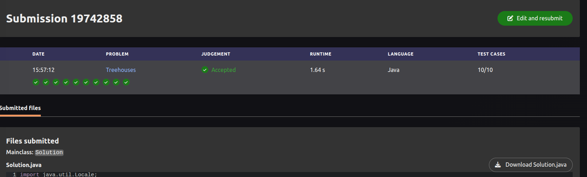

# Treehouses - Kattis

## Informacoes do Trabalho

- **Nome do problema:** Treehouses
- **Link do problema:** <https://open.kattis.com/problems/treehouses>
- **Grupo:** Grupo C
- **Integrantes:** Igor Praciano, Rafael Lima e Tiago Silveira
- **Linguagem utilizada:** Java

## Evidencia de Accepted



## Estrutura do Projeto

```text
.
├── dados/
│   ├── dados01.txt
│   ├── dados02.txt
│   └── dados03.txt
├── evidencias/
│   └── accepted.png
├── src/
│   ├── Main.java
│   └── algs4/
│       ├── Edge.java
│       ├── EdgeWeightedGraph.java
│       ├── KruskalMST.java
│       ├── UF.java
│       └── ...
└── README.md
```

## Como Executar a Solucao

Compile colocando as classes em uma pasta de saida:

```bash
javac -d out src/algs4/*.java src/Main.java
```

Execute com um arquivo de entrada:

```bash
java -cp out Main < dados/dados02.txt
```

Observacao: a `Main.java` tambem tenta abrir `dados/dados02.txt` automaticamente se esse arquivo existir. Isso facilita testes locais. No Kattis, esse arquivo nao existe no ambiente de submissao, entao a solucao usa normalmente a entrada padrao.

## Modelagem como Grafo Ponderado

O problema pode ser modelado como um **grafo nao direcionado ponderado**:

- **Vertices:** cada treehouse e um vertice do grafo.
- **Arestas:** cada par de treehouses pode receber um cabo, entao o grafo considerado e completo.
- **Pesos:** o peso de uma aresta e o comprimento do cabo entre duas treehouses.
- **Arestas gratuitas:** conexoes que ja existem entram no grafo com peso `0.0`.

Na entrada, as treehouses sao numeradas a partir de `1`. Na implementacao, elas sao convertidas para indices de `0` a `n - 1`, que e o padrao usado pelas estruturas do `algs4`.

O peso entre duas treehouses `i` e `j` e calculado pela distancia euclidiana:

```text
dist(i, j) = sqrt((xi - xj)^2 + (yi - yj)^2)
```

Assim, encontrar o menor comprimento adicional de cabos equivale a encontrar uma **Arvore Geradora Minima** no grafo.

## Algoritmo Utilizado

A solucao usa **Kruskal**, implementado pela classe `KruskalMST` da pasta `src/algs4`.

Na `Main.java`, o fluxo principal e:

1. Ler `n`, `e` e `p`.
2. Ler as coordenadas das `n` treehouses.
3. Criar um `EdgeWeightedGraph` com `n` vertices.
4. Adicionar arestas de peso `0.0` para as primeiras `e` treehouses, que ja estao conectadas.
5. Adicionar arestas de peso `0.0` para os `p` cabos ja existentes informados na entrada.
6. Adicionar todas as arestas possiveis entre pares de treehouses, usando distancia euclidiana como peso.
7. Executar `KruskalMST`.
8. Imprimir `mst.weight()`, que representa o menor comprimento adicional necessario.

## Papel do Union-Find/DSU

Como a solucao usa Kruskal, o **Union-Find/DSU** e essencial para controlar os componentes conectados durante a construcao da arvore geradora minima.

No `KruskalMST`, as arestas sao analisadas em ordem crescente de peso. Para cada aresta `(v, w)`:

- se `v` e `w` estao em componentes diferentes, a aresta pode ser adicionada sem formar ciclo;
- depois disso, os dois componentes sao unidos com `union(v, w)`;
- se os vertices ja estao no mesmo componente, a aresta e ignorada.

Esse processo garante que o algoritmo sempre escolha arestas baratas sem criar ciclos.

## Papel da Escolha da Proxima Aresta

Esta solucao nao usa Prim. Portanto, nao ha fila de prioridade para escolher a proxima aresta a partir de uma fronteira de vertices visitados.

No Kruskal, a escolha da proxima aresta acontece pela **ordenacao global de todas as arestas por peso**. A classe `KruskalMST` organiza as arestas em ordem crescente e percorre essa lista, usando o Union-Find para decidir se cada aresta entra ou nao na MST.

## Variacao de MST Usada

A variacao usada e uma MST com **arestas preexistentes de custo zero**.

As conexoes que ja existem no problema nao precisam ser pagas novamente, entao elas sao representadas como arestas de peso `0.0`. Com isso, o Kruskal pode escolher essas arestas gratuitamente antes das demais, e o peso final da MST representa apenas o custo adicional que ainda precisa ser construido.

## Casos Especiais Relevantes

- Se as primeiras `e` treehouses ja conectam parte do grafo, essas conexoes entram com custo zero.
- Se existem `p` cabos ja instalados, eles tambem entram com custo zero.
- Se todas as treehouses ja estiverem conectadas pelas arestas gratuitas, a resposta pode ser `0.0000000000`.
- A entrada usa indices iniciando em `1`, mas o codigo converte para indices iniciando em `0`.
- A saida usa `Locale.US` para garantir ponto decimal, como esperado pelo Kattis.

## Analise de Complexidade

Como o grafo e completo, o numero de arestas candidatas e:

```text
m = n(n - 1) / 2
```

Considerando `m` como o numero de arestas:

- Gerar todas as arestas: `O(n^2)`;
- Ordenar as arestas no Kruskal: `O(m log m)`;
- Operacoes de Union-Find: aproximadamente `O(m α(n))`, quase linear;
- Armazenar o grafo e as arestas: `O(m)`.

A etapa dominante e a ordenacao das arestas, entao a complexidade de tempo fica em:

```text
O(m log m) = O(n^2 log n)
```

A complexidade de espaco e:

```text
O(m) = O(n^2)
```
