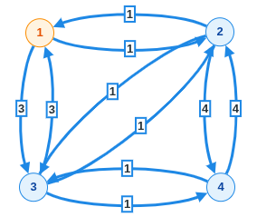
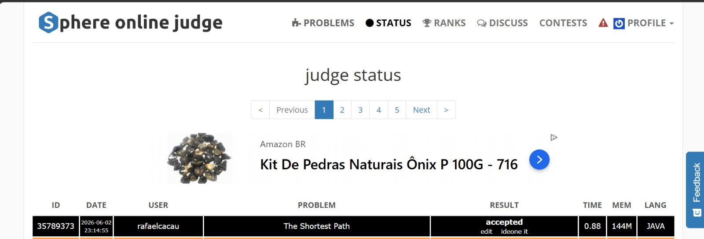

# SHPATH - The Shortest Path (SPOJ)

Este repositório contém a resolução do problema **SHPATH - The Shortest Path** para o Trabalho Prático 2 da Unidade 3 de Teoria dos Grafos.

- **Link do Problema:** [SPOJ - SHPATH](https://www.spoj.com/problems/SHPATH/)
- **Grupo:** Grupo C
- **Integrantes:** 
  - [Nome do Integrante 1]
  - [Nome do Integrante 2]
  - [Nome do Integrante 3]
- **Linguagem Utilizada:** Java (JDK 11 ou superior)
- **Orientador:** Prof. Me Ricardo Carubbi

---

## 📁 Estrutura do Repositório

```text
T2/
├── README.md                # Este arquivo com as informações do projeto
├── evidencias/
│   ├── evidencia.jpeg       # Comprovação de Accepted no site do SPOJ
│   └── grapho.png           # Grafo gerado a partir do caso de teste
├── apresentacao/
│   └── apresentacao.pdf     # Apresentação PDF
├── dados/
│   └── dados02.txt          # Dados de entrada de teste local
└── src/
    ├── Main.java            # Ponto de entrada com algs4
    ├── Solution.java        # Solução autocontida para envio ao SPOJ
    └── algs4/               # Arquivos da biblioteca algs4
```

---

## 🛠️ Como Executar a Solução

A solução foi projetada de forma a ler a entrada localmente a partir de `dados/dados02.txt` caso o arquivo exista. Se executado no ambiente de submissão do SPOJ, lê diretamente da entrada padrão (`System.in`).

### Passo 1: Compilar o código
No terminal, na pasta raiz do projeto (`T2`), compile a classe principal:
```bash
javac src/Main.java
```
*(O compilador do Java compilará automaticamente as classes da biblioteca `algs4` necessárias).*

### Passo 2: Executar
Execute a classe principal para rodar os casos de teste:
```bash
java -cp src Main
```

---

## 📊 Caso de Teste e Modelagem do Grafo

### Entrada de Teste (`dados/dados02.txt`)
O arquivo de teste local contém o seguinte cenário com 4 cidades e 2 consultas:
```text
1
4
gdansk
2
2 1
3 3
bydgoszcz
3
1 1
3 1
4 4
torun
3
1 3
2 1
4 1
warszawa
2
2 4
3 1
2
gdansk warszawa
bydgoszcz warszawa
```

### Grafo Gerado
Abaixo está a representação visual do grafo gerado a partir dos dados acima:



#### Resultado Esperado das Consultas:
1. `gdansk` $\rightarrow$ `warszawa`: **Custo 3** (Caminho: Gdansk $\xrightarrow{1}$ Bydgoszcz $\xrightarrow{1}$ Torun $\xrightarrow{1}$ Warszawa)
2. `bydgoszcz` $\rightarrow$ `warszawa`: **Custo 2** (Caminho: Bydgoszcz $\xrightarrow{1}$ Torun $\xrightarrow{1}$ Warszawa)

---

## 🧠 Modelagem do Grafo e Algoritmo

### 1. Modelagem e Representação
O problema pede para encontrar o caminho mínimo em um grafo direcionado e ponderado de cidades, onde a identificação dos nós é feita por strings (nomes das cidades).
- **Vértices ($V$):** Cidades mapeadas para índices inteiros `0` a `N-1`.
- **Arestas ($E$):** Rotas de transporte direcionadas e ponderadas com custos positivos ($peso > 0$).
- **Mapeamento de Nomes:** Foi utilizada uma estrutura de tabela hash (`HashMap<String, Integer>`) para associar o nome de cada cidade (string) ao seu respectivo índice numérico. Isso permite encontrar o índice correspondente à origem e destino em tempo constante $O(1)$.
- **Estrutura do Grafo:** O grafo é representado por uma lista de adjacências usando a classe `EdgeWeightedDigraph` da biblioteca `algs4`.

### 2. Algoritmo Utilizado
Utilizou-se o **Algoritmo de Dijkstra** para caminhos mínimos a partir de uma origem única, implementado pela classe `DijkstraSP` da biblioteca `algs4` (ou versão otimizada na classe `Solution`). 

#### Variação do Dijkstra Utilizada:
- Na classe `Main.java`, executamos a classe padrão `DijkstraSP`.
- Na classe `Solution.java` (enviada ao SPOJ), implementamos uma **parada antecipada** assim que o nó destino é retirado da fila de prioridade, melhorando substancialmente o tempo de execução nas múltiplas consultas ($r \le 100$).

---

## 📈 Análise de Complexidade

- **Complexidade de Tempo:**
  - **Construção do grafo:** $O(V + E)$
  - **Consultas de caminhos mínimos:** $O(R \times (V + E) \log V)$, onde $R$ é o número de consultas de caminhos mínimos. A cada consulta, rodamos o Dijkstra usando uma fila de prioridades Heap que leva $O((V+E) \log V)$ no pior caso.
  - **Complexidade total:** $O(S \times (V + E + R \times (V + E) \log V))$, onde $S$ é o número de casos de teste.
- **Complexidade de Espaço:** $O(V + E)$ para manter a estrutura de listas de adjacência do grafo na memória e $O(V)$ para a tabela hash do mapeamento.

---

## 💻 Trechos de Código Importantes (`Main.java`)

### Leitura da Entrada e Mapeamento de Cidades
```java
HashMap<String, Integer> map = new HashMap<>();
int n = StdIn.readInt();
EdgeWeightedDigraph graph = new EdgeWeightedDigraph(n);

for (int j = 0; j < n; j++) {
    String name = StdIn.readString();
    map.put(name, j); // Mapeia string para o índice local 0-based

    int p = StdIn.readInt(); // Número de vizinhos
    for (int k = 0; k < p; k++) {
        int nr = StdIn.readInt(); // Índice do vizinho (1-based no arquivo)
        double cost = StdIn.readInt();
        // Adiciona aresta ajustando o índice do vizinho para 0-based
        graph.addEdge(new DirectedEdge(j, nr - 1, cost));
    }
}
```

### Resolução das Consultas (Dijkstra)
```java
int r = StdIn.readInt(); // Número de consultas de caminhos mínimos
for (int j = 0; j < r; j++) {
    String name1 = StdIn.readString();
    int index1 = map.get(name1); // Busca do índice de origem

    String name2 = StdIn.readString();
    int index2 = map.get(name2); // Busca do índice de destino

    // Roda o Dijkstra a partir do nó origem
    DijkstraSP dijkstra = new DijkstraSP(graph, index1);
    
    // Imprime a distância mínima para o destino
    System.out.println((int) dijkstra.distTo(index2));
}
```

---

## 🏆 Evidência de Accepted no SPOJ

O código foi submetido e aceito no site do SPOJ:


